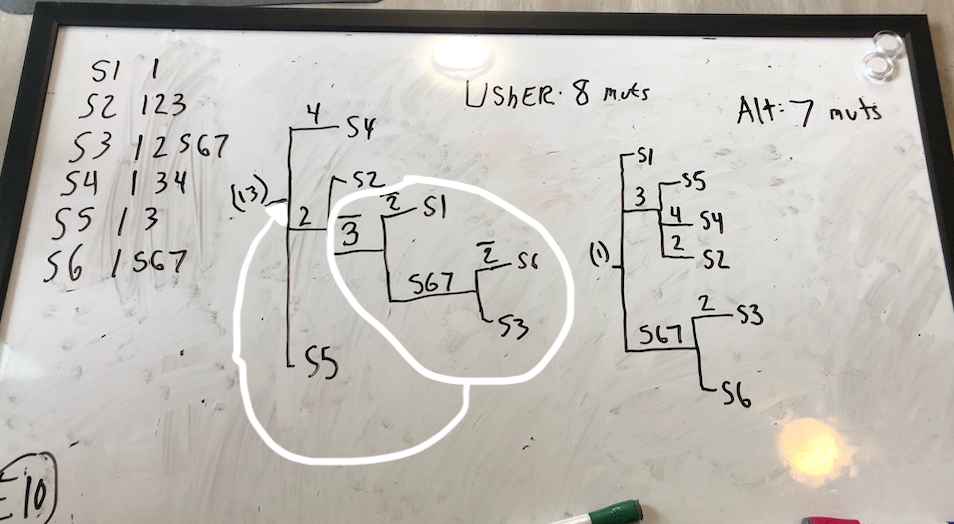
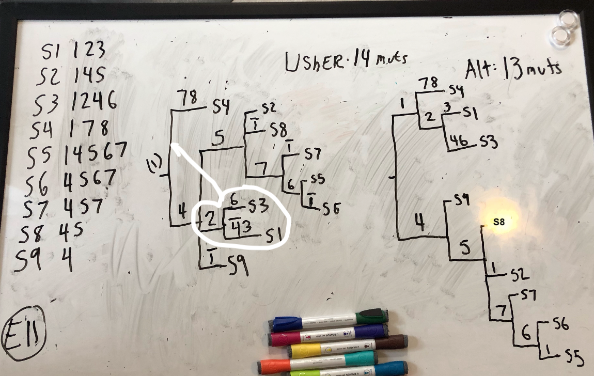

To use for testing UShER on tree move examples. Run `python makeTreeMoveTestExamples.py example1.txt` to yield a set of 2 fasta files corresponding to the example given. Example files should follow this format:

S1	m1,m2,m3  
S2	m1  
S3	m1,m3,m4,m5  
S4	m1,m2,m3,m5,m6  
S5	m1,m3,m5,m6  
S6	m1,m5,m6  
S7	m5,m6  
S8	m6  

etc., with mutations ending in ? converted to IUPAC representing reference or alt.

I have been following this protocol:  

- First, create an example.txt file like the one above. Then:  

`python makeTreeMoveTestExamples.py EXAMPLES/example12.txt 4`    
`faToVcf EXAMPLES/example12_1.fa EXAMPLES/example12_1.vcf`    
`python addFakeLastLine.py EXAMPLES/example12_1.vcf`    
`faToVcf EXAMPLES/example12_2.fa EXAMPLES/example12_2.vcf`    
`python addFakeLastLine.py EXAMPLES/example12_2.vcf`    

`usher --tree empty.nh --vcf EXAMPLES/example12_1.vcf --collapse-tree --save-mutation-annotated-tree EXAMPLES/example12.pb`    
`mv final-tree.nh initial_tree.nh`    
`usher --tree initial_tree.nh --vcf EXAMPLES/example12_1.vcf --collapse-tree --save-mutation-annotated-tree EXAMPLES/example12.pb`    
`mv final-tree.nh initial_tree.nh`    
`usher --vcf EXAMPLES/example12_2.vcf --load-mutation-annotated-tree EXAMPLES/example12.pb --write-uncondensed-final-tree`    
`mv uncondensed-final-tree.nh ex12Final.nh`    
- Then, load "initial_tree.nh" and "ex12Final.nh" into FigTree, and look for ways that the tree could be made better in terms of total mutations.

In this directory are two example files where one tree-move results in a better tree than what UShER produces. I will attach all such examples to this directory as I find them.  

Example 10:  

  

Example 11:  

