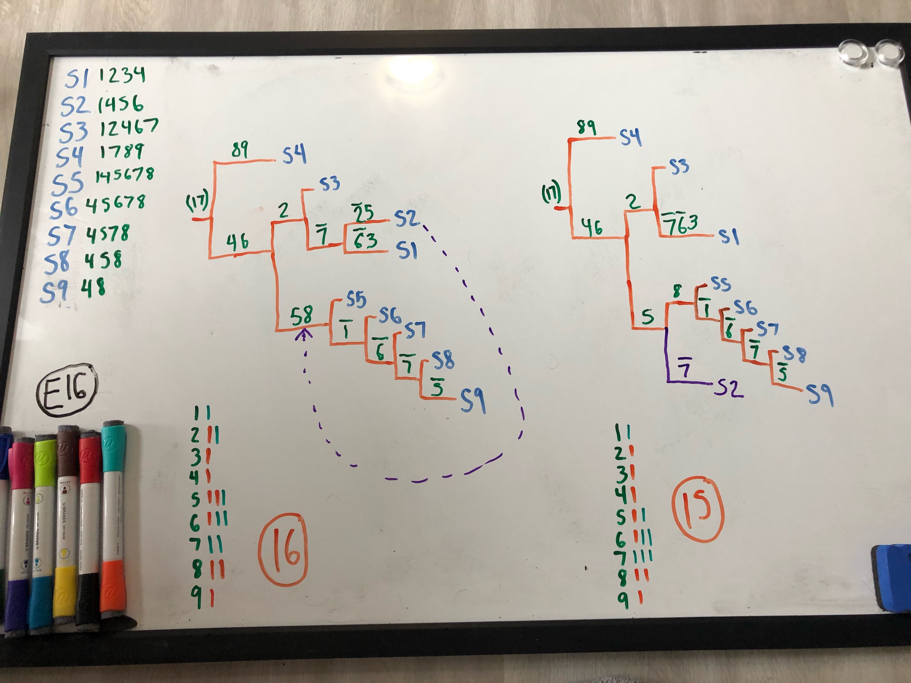

To use for testing UShER on tree move examples. Run `python makeTreeMoveTestExamples.py example1.txt` to yield a set of 2 fasta files corresponding to the example given. Example files should follow this format:

S1	m1,m2,m3  
S2	m1  
S3	m1,m3,m4,m5  
S4	m1,m2,m3,m5,m6  
S5	m1,m3,m5,m6  
S6	m1,m5,m6  
S7	m5,m6  
S8	m6  

etc., with mutations ending in ? converted to IUPAC representing reference or alt.

I have been following this protocol:  

- First, create an example.txt file like the one above. Then:  

`python makeTreeMoveTestExamples.py EXAMPLES/example1.txt 4`    
`faToVcf EXAMPLES/example1_1.fa EXAMPLES/example1_1.vcf`    
`python addFakeLastLine.py EXAMPLES/example1_1.vcf`    
`faToVcf EXAMPLES/example1_2.fa EXAMPLES/example1_2.vcf`    
`python addFakeLastLine.py EXAMPLES/example1_2.vcf`    

`usher --tree empty.nh --vcf EXAMPLES/example1_1.vcf --collapse-tree --save-mutation-annotated-tree EXAMPLES/example1.pb`    
`mv final-tree.nh e1.nh`    
`usher --tree e1.nh --vcf EXAMPLES/example1_1.vcf --collapse-tree --save-mutation-annotated-tree EXAMPLES/example1.pb`    
`mv final-tree.nh e1.nh`    
`usher --vcf EXAMPLES/example1_2.vcf --load-mutation-annotated-tree EXAMPLES/example1.pb --write-uncondensed-final-tree`    
`mv uncondensed-final-tree.nh e1Final.nh`    
- Then, load "e1.nh" and "e1Final.nh" into FigTree, and look for ways that the tree could be made better in terms of total mutations.

In this directory are two example files where one tree-move results in a better tree than what UShER produces. I will attach all such examples to this directory as I find them.  

Example 10:  

  

Example 11:  

Example 16:  

Example 17:  

